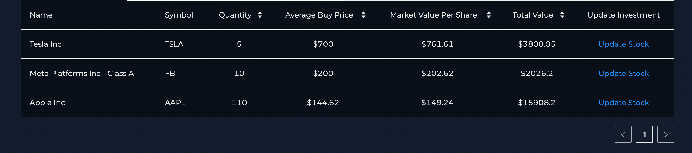
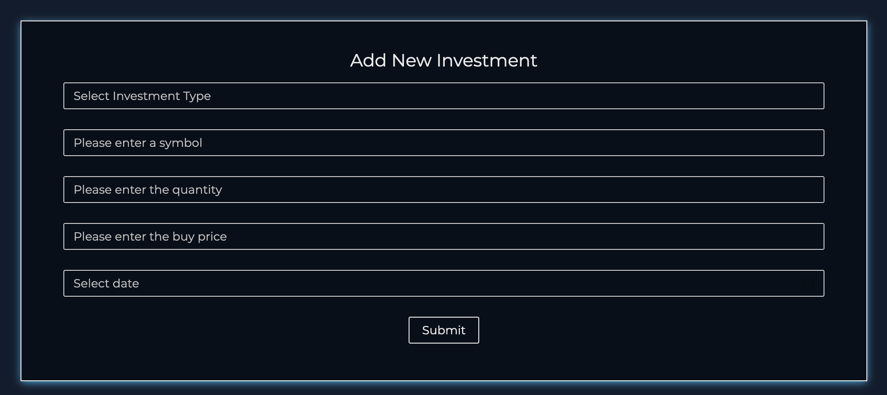
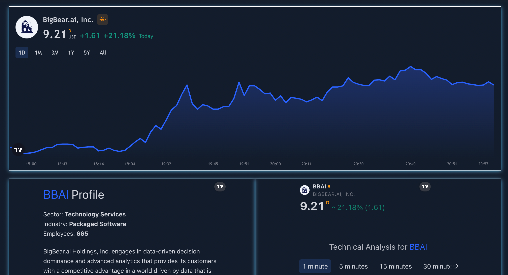
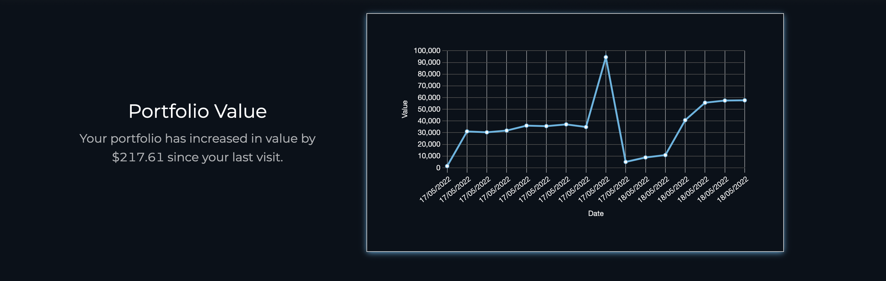
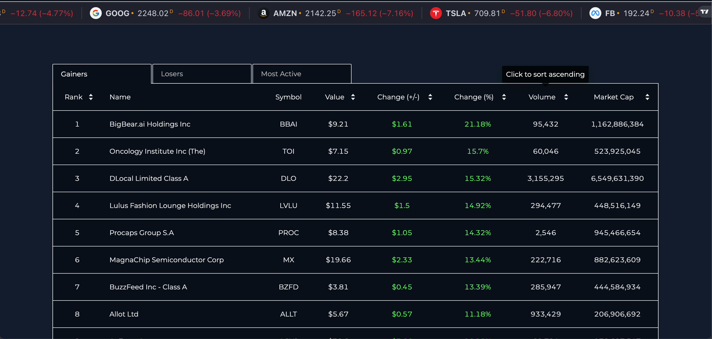

# StockVista_frontend

## Overview
StockVista is stock market investment web application that allows users to perform a number of tasks including:

* Browse realtime stock data using IEX API.

* Browse the latest market news using NEWS API.

* Buy and Sell stocks at realtime prices.

* Used Auth0 for Signup/login.

* View portfolio statistics with interactive graphs using Chart.js and Trading View Widgits

* Largest stock holds

* Value of portfolio over time along with charts

* The implementation of the API client using the Redux toolkit resulted in a reduction in the time required to set
up server communication and define endpoints
---

## Technologies used in the application
The following technologies were used in the application:
* React JS
* TypeScript
* Sass
* Chart.js
---

## Screenshots of StockVista in action
Portfolio

Add a new stock

Stock Details

Portfolio value over time

Browse Stock Market

